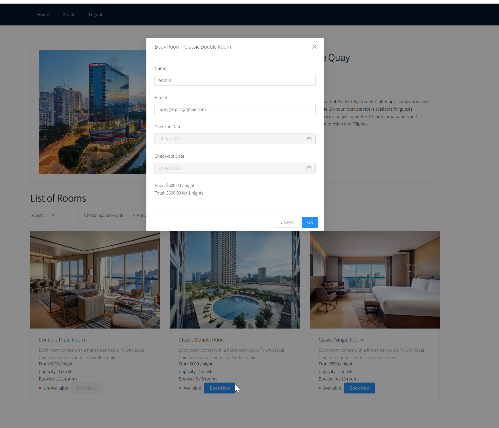
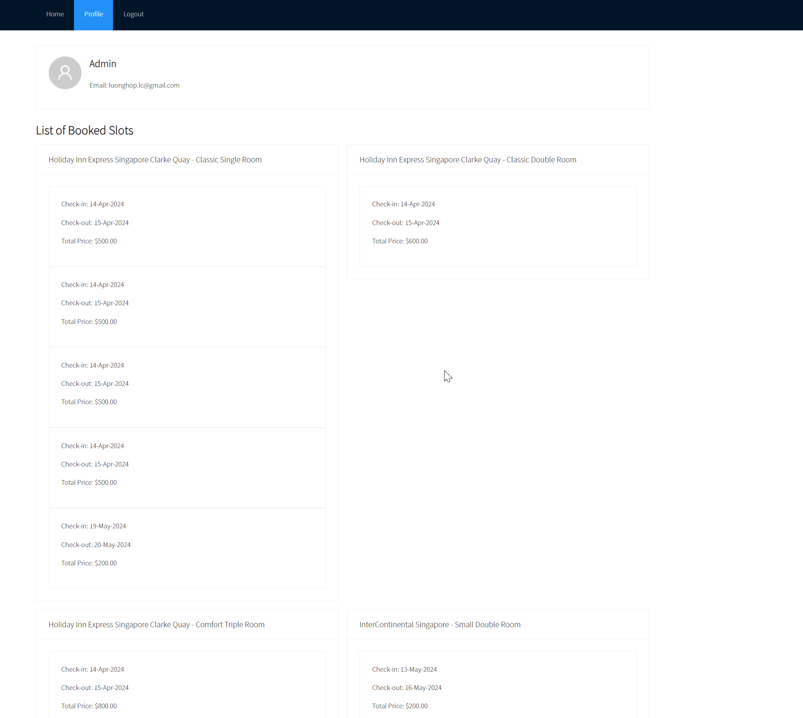
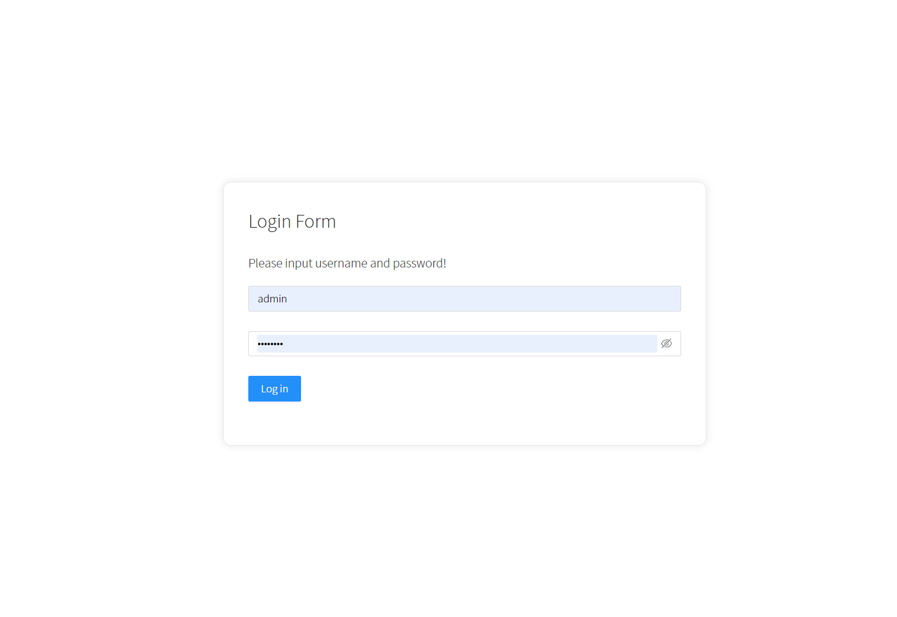

# Hotel Booking

Build a Hotel Booking REST API service with NodeJs:

Service provides APIs to Search, book and manage the hotel room booking

#### Design Database Schema

Note: removed module customer. No longer using the module. Remove source soon.


#### Screenshots






#### API document with PostMan

In order to test API, please import postman collection and environment files in ./backend/PostMan


#### Technologies

- [ExpressJs] https://expressjs.com
- [Sequelize] https://sequelize.org/docs/v6/core-concepts/model-basics
- [MySQL] https://www.mysql.com
- [ReactJs] https://react.dev
- [AntDesign] https://ant.design

#### Start app locally

Step 1: Download source code and install packages
We need to install package for root, frontend, backend folders

```bash

git clone https://github.com/luongbahop/hotel-booking-app.git
cd hotel-booking-app
npm run install
npm run install-all
```

Step 2: Create .env file in folder /backend

```bash
# APP configs
APP_PORT=3001
APP_ENV='development'
APP_VERSION='1.0.0'

# DATABASE configs
DB_HOST='localhost'
DB_DIALECT='mysql'
DB_DATABASE='booking_hotel'
DB_USERNAME='root'
DB_PASSWORD=''

# AUTH configs
AUTH_ACCESS_SECRET='access secret booking hotel'
AUTH_ACCESS_TOKEN_LIFE='1d'
AUTH_REFRESH_SECRET='refresh secret booking hotel'
AUTH_REFRESH_TOKEN_LIFE='30d'
```

Step 3: Create and import demo database
Use the demo database ./backend/Database/booking_hotel.sql and import to MySQL

Step 4: Start backend and frontend in local
From root folder, please run

```bash
npm run dev
```

#### Available scripts

Scripts in root folder

```sh
  "scripts": {
    "dev": "concurrently \"cd backend && npm run dev\" \"cd frontend && npm run start\"",
    "install-all": "concurrently \"cd backend && npm install\" \"cd frontend && npm install\""
  }
```

Scripts in backend folder

```sh
"scripts": {
    "start": "node src/index.js",
    "dev": "nodemon src/index.js",
    "format": "prettier --write \"./src\"",
    "lint": "eslint . --ext .js",
    "lint-fix": "eslint . --ext .js --fix",
    "test": "echo \"Error: no test specified\" && exit 1"
  }

```

Scripts in frontend folder

```sh
  "scripts": {
    "start": "react-scripts start",
    "build": "react-scripts build",
    "test": "react-scripts test",
    "eject": "react-scripts eject"
  }
```

#### Completed tasks list

- Manage Hotels: create, read, update, delete hotels
- Manage Rooms: create, read, update, delete rooms
- Manage Users: create, read, update, delete users(admin role). Login, change-password
- Manage Customers: create, read, update, delete customers
- Manage Bookings: create, read, update, delete bookings

#### To-do tasks list

- Forgot password
- Remove customer module
- Send E-mail after user logged in, booked a room...
- Pagination for get list of records
- Deploy backend to VPS/Cloud
