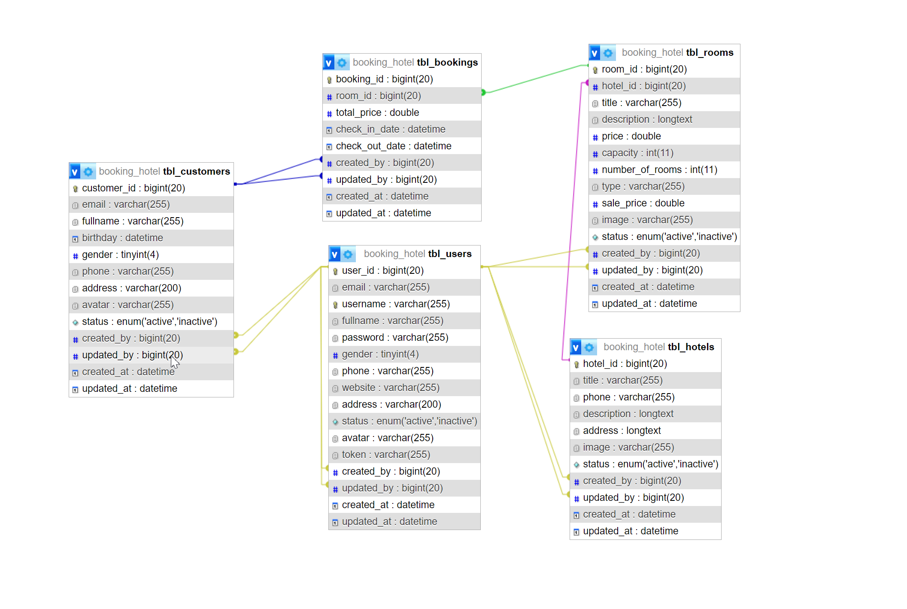
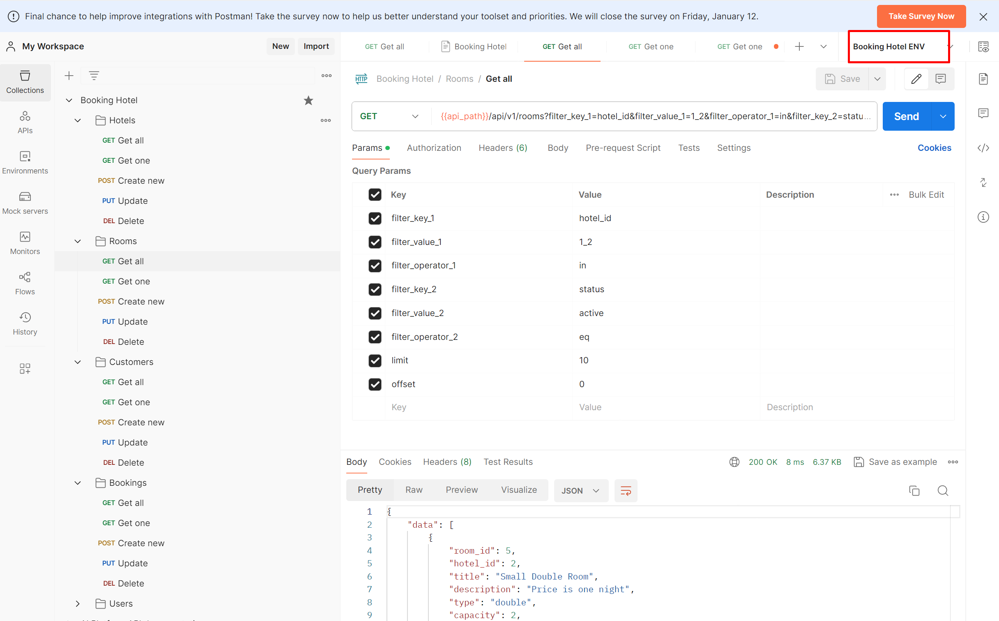

# Hotel Booking

Build a Hotel Booking REST API service with NodeJs:

Service provides APIs to Search, book and manage the hotel room booking

#### Design Database Schema



#### API document with PostMan

In order to test API, please import postman collection and environment files in ./backend/PostMan


#### Technologies

- [ExpressJs] https://expressjs.com
- [Sequelize] https://sequelize.org/docs/v6/core-concepts/model-basics
- [MySQL] https://www.mysql.com/

#### Start app locally

```bash

git clone https://github.com/luongbahop/hotel-booking-app.git
cd hotel-booking-app/backend
npm install
npm run dev

```

#### Available scripts

```sh
"scripts": {
    "start": "node src/index.js",
    "dev": "nodemon src/index.js",
    "format": "prettier --write \"./src\"",
    "lint": "eslint . --ext .js",
    "lint-fix": "eslint . --ext .js --fix",
    "test": "echo \"Error: no test specified\" && exit 1"
  },
// Start running the project
npm run start
// Start the project with Nodemon
npm run dev
// Format source code
npm run format
```

#### Completed tasks list

- Manage Hotels: create, read, update, delete hotels
- Manage Rooms: create, read, update, delete rooms
- Manage Users: create, read, update, delete users(admin role). Login, change-password
- Manage Customers: create, read, update, delete customers
- Manage Bookings: create, read, update, delete bookings

#### To-do task list

- Forgot password
- Send E-mail after user logged in, booked a room...
- Pagination for get list of records
- Deploy backend to VPS/Cloud
